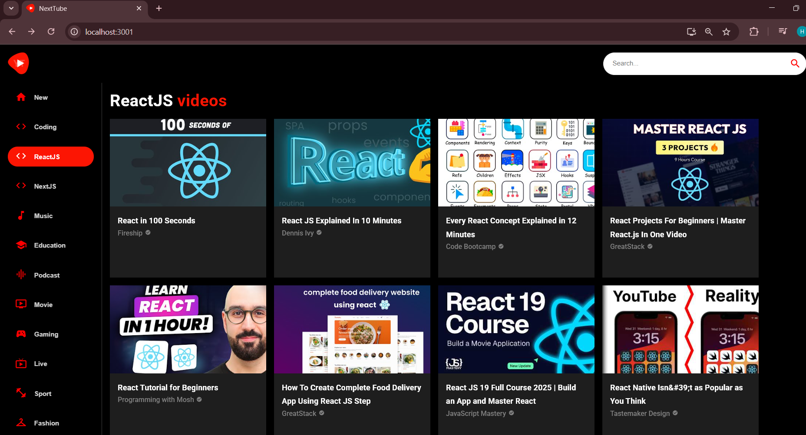
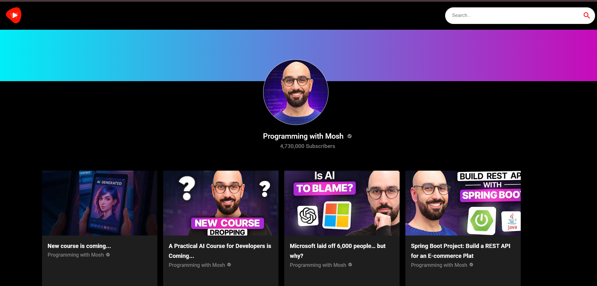

# NextTube

## About  
NextTube is a React-based YouTube clone app leveraging the YouTube Data API via RapidAPI. Users can search videos, view video details, and browse by categories.

## Project Objective  
Reproduce core YouTube features—search, playback, related videos—using modern React, React Router, and Material-UI.

## Live Demo  
https://<your-netlify-subdomain>.netlify.app

## Features  
- Video search with autocomplete  
- Responsive video player integration (ReactPlayer)  
- Related videos suggestion feed  
- Sidebar category navigation  
- Mobile-responsive layout  

## Project Workflow  
1. **Setup:** Create React App scaffold  
2. **API Integration:** `fetchFromAPI.js` uses Axios + RapidAPI headers  
3. **Routing:** React Router for `/`, `/video/:id`, `/search/:term`  
4. **UI Components:** MUI for Card layouts, Icons, Stack, Box  
5. **Deployment:** Production build with `npm run build` → Netlify CI/CD  

## Screenshots  
  
  

## Tech Stack  
- React  
- React Router  
- Axios  
- Material-UI  
- ReactPlayer  
- Netlify for hosting  

## Conclusion  
NextTube successfully emulates YouTube’s search and playback experience with a clean, responsive UI and seamless API integration.

## Maintainer  
Harshitha Sai  
© 2025 Harshitha Sai
